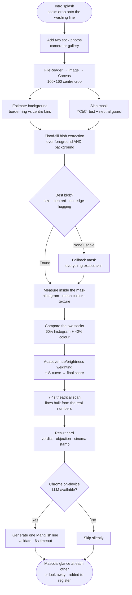

# Porutham Undo? 🧦

> Sock compatibility verification.
> *Show us two socks. We check their colour, pattern and texture, then rule on whether they belong together.*

## Basic Details
### Team Name: Porutham


### Team Members
- Member 1: Mirsal Fathima Ajeeb - Saintgits College of Applied Sciences
- Member 2: Renjana S P - Saintgits College of Applied Sciences

### Project Description
Porutham Undo? applies the full ceremonial weight of Kerala marriage compatibility matching to a pair of socks. Photograph two socks, and the app runs an actual computer-vision pipeline on them — background removal, skin masking, colour histograms, texture gradients — then delivers a percentage score, a Manglish verdict, a specific complaint about which sock is at fault, and a cinema-poster stamp ranging from MASS ENTRY to FLOP SHOW.

### The Problem (that doesn't exist)
Every morning, millions of people pull two socks from a drawer and simply *decide* they go together. No consultation. No verification. No score. Two garments are bound together for an entire day on nothing but vibes and a glance in bad bedroom lighting. Meanwhile we run elaborate compatibility checks before human marriages, and yet the humble sock pair — a union that must survive walking, sweating and the washing machine — gets none of that scrutiny. Nobody has ever asked a sock whether it consents to its partner.

### The Solution (that nobody asked for)
A full porutham verification ceremony, for socks. Upload or photograph the two candidates. The app segments each sock out of its photo, measures its colour distribution and surface texture, scores the pair, and then judges them out loud like a Malayali friend who has strong opinions and no filter.

The verdicts run across six score bands, from *"Apo engana machu… SET AAHLO! 😂"* at the top to *"Da… ivare enthinaa onnich konduvannath 😭"* at the bottom. Then it stamps the result like a movie poster:

| Score | Stamp | Caption |
|---|---|---|
| 90+ | 🎬 **MASS ENTRY** | Ee jodi kidilan aayipoyi! |
| 75+ | 🔥 **SUPERHIT** | Kollam da, set aanu! |
| 55+ | 🍿 **SECOND SHOW** | Okay aanu... theatre il kaanam. |
| 35+ | 😅 **SEMI FLOP** | Ithu oru... doubtful scene da. |
| 0+ | 💀 **FLOP SHOW** | Adi paavam... next try machu. |

Two sock mascots hang on a washing line and watch the entire proceeding. Their eyes follow your cursor. They blink on separate schedules so they never blink in sync. When a pair scores well, they glance at each other. When it goes badly, they look away.

## Technical Details
### Technologies/Components Used
For Software:
- **Languages used:** HTML5, CSS3, vanilla JavaScript (ES2020)
- **Frameworks used:** None. No build step, no bundler, no dependencies to install.
- **Libraries used:** No JS libraries. Canvas 2D API for image analysis, Web Audio API for the verdict chimes, Google Fonts (Fraunces, Fredoka, Nunito) for type. Chrome's built-in on-device `LanguageModel` API as an *optional* enhancement.
- **Tools used:** A text editor, a browser, and an unreasonable number of socks.

The joke is the premise — the image analysis underneath is real:

- **Background estimation.** The 160×160 centre crop is split into a border ring and a centre region. Colour bins that dominate the ring but *not* the centre are marked as background. A colour that owns the middle of the frame is the sock, even if it also touches the edge.
- **Skin masking.** Legs are always in a sock photo. A YCbCr-space skin test cuts them out, with a chroma guard in front of it so that a white, grey or black sock — which is neutral, not reddish — is never mistaken for a leg.
- **Blob extraction.** Flood-fill connected-component labelling runs over *both* the foreground candidates and the presumed background, because a dark sock running off the edge of the frame gets misclassified as background on the first pass. Each candidate blob is then scored on three properties a sock actually has: sensible size (7–80% coverage), proximity to the frame centre, and *not* hugging the frame edge. Background hugs the edge; a sock doesn't.
- **Measurement.** Inside the winning mask only: a 64-bin RGB histogram (2 bits per channel), mean colour, and a mean luminance gradient across horizontal and vertical neighbours as a texture proxy. The histogram is then smoothed across adjacent bins so a lighting shift doesn't tank an otherwise good match.
- **Scoring.** Histogram intersection (60%) plus colour similarity (40%). The colour term weighs hue against brightness *adaptively*: for saturated socks hue carries the meaning, but for neutral socks (white, grey, black) the hue is identical and brightness is the only colour information that exists, so the weighting flips. An S-curve is applied at the end to push convincing pairs up and unconvincing pairs down, instead of collecting everything around 60%.
- **Texture is measured but scored at weight zero — and we left the reason in the source.** At this resolution the gradient is dominated by JPEG noise rather than knit structure: in testing it rated two completely different socks 99% alike and a genuine matching pair only 90%. It's still displayed on the result card, because it looks convincing, which is the most honest thing in the project.
- **Honest failure reporting.** The result card shows *"what we actually looked at"* — the masked thumbnails, background stripped — so you can see whether segmentation worked. If the two photos were shot under different lighting (detected via scene brightness ratio and chromaticity drift) it warns you that the score is unreliable. If the mask covered almost nothing or almost everything, it says so.
- **The scan sequence is pre-computed.** The 7.4-second theatrical loading sequence looks like it's thinking, but the comparison is calculated *before* the animation starts, so every line — "🎨 Colour check… randu team pole und da 😭" — reflects the actual numbers rather than being generic filler.
- **Optional on-device LLM.** If you're on Chrome 138+ with the built-in `LanguageModel` API available, one extra Manglish line is generated locally about what specifically matched and what didn't. It's validated hard: rejected if it's over 12 words, if it contains Malayalam script instead of Manglish, or if it doesn't actually contain Manglish markers (`machu`, `da`, `und`, `aanu`, `set`, `vibe`…). It races a 6-second timeout so it can never hang a demo. **No API key, no network request, nothing leaves the device** — and if the model isn't there, the panel simply never appears.
- **Everything is local.** Photos are read with `FileReader` and analysed on a canvas in your tab. Nothing is uploaded anywhere. There is no backend. The match register clears on reload.
- **Platform handling:** camera vs gallery buttons are chosen by pointer/touch detection, HEIC files are caught early with iPhone-specific guidance, and canvas-tainting errors from `file://` produce a real explanation with the `python3 -m http.server` fix rather than a silent failure.

For Hardware:
- No hardware components. Required in the physical world: two socks, and a light source you can stand in for both photos.

### Implementation
For Software:
# Installation
```bash
git clone https://github.com/[your-username]/porutham-undo.git
cd porutham-undo

# No dependencies. Nothing to install.
```

# Run
```bash
# Recommended — serve it locally so the canvas can read your photo pixels
python3 -m http.server 8000
# then visit http://localhost:8000/Porutham_Undo.html
```

> ⚠️ Opening the file directly with `file://` works for browsing, but some browsers block canvas pixel reads on local files, which is exactly what the analysis needs. If you see **"pixels blocked"**, use the local server command above. The app tells you this itself when it happens.

**Optional AI line:** Chrome 138+ with the built-in AI model enabled will add a generated Manglish verdict line. Every other browser silently skips it and the written verdicts carry on as normal.

### Project Documentation
For Software:

# Screenshots (Add at least 3)

*The intro splash — two kasavu-themed sock mascots dropping onto a washing line with a heart between them. Tap to skip.*


*The intake screen. Two slots, each with camera and gallery options, and the mascots hanging above watching you make your choices.*


*Mid-scan. "🧵 Pattern check… ivide aanu kurach scene 😭" — every line here is derived from the real comparison numbers, computed before the animation began.*


*A result card: animated score counter, cinema stamp, the specific objection, the four stat blocks, and the "what we actually looked at" masked thumbnails proving the segmentation worked.*

# Diagrams


*Top-down flow of a single verification. Note that the score is fully computed at step K — the scanning animation that follows is pure theatre, but the lines it displays are honest.*


*Optional — the Mermaid block above renders natively on GitHub, so an image is only needed if you want a stylised version for the demo.*

For Hardware:

N/A — no hardware involved in this project.

### Project Demo
# Video
[Demo video](https://drive.google.com/drive/folders/13oPpPBN66rPeqB699mEVxEhDyILwfafS?usp=sharing)

*Demonstrates uploading two mismatched socks and then two matching socks, showing the scoring difference and the sass level scaling accordingly — from a savage roast on a bad pair to full confetti celebration on a great match.*


## Team Contributions
- **Mirsal Fathima Ajeeb:** Project ideation, UI/UX design, front-end interface development, visual design, AI/LLM integration, user interaction flow, and project presentation.
- **Renjana S P:** Image processing and sock feature analysis, compatibility calculation, animations and sound effects, testing and debugging, project documentation, and deployment.

---
Made with ❤️ at TinkerHub Useless Projects 


