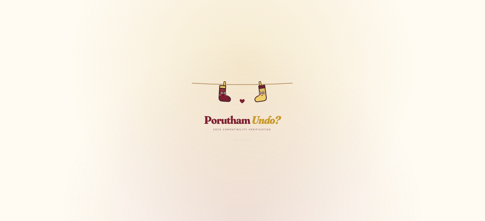
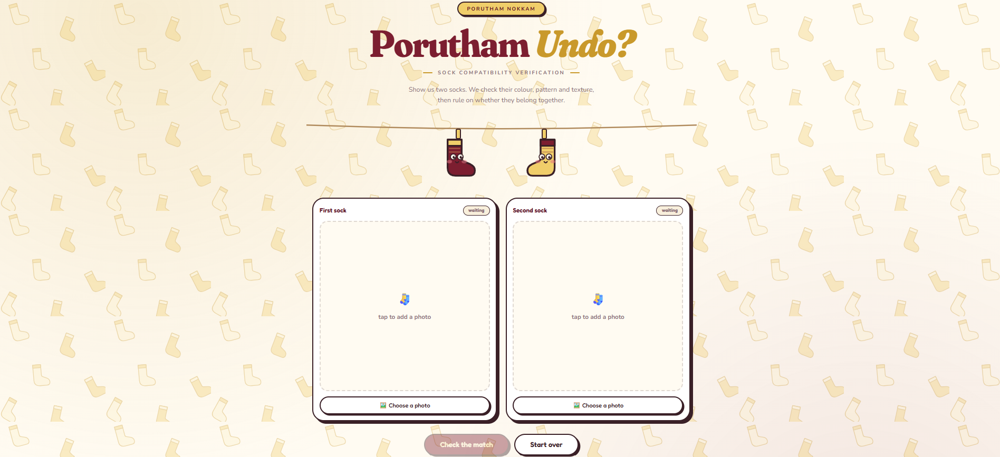
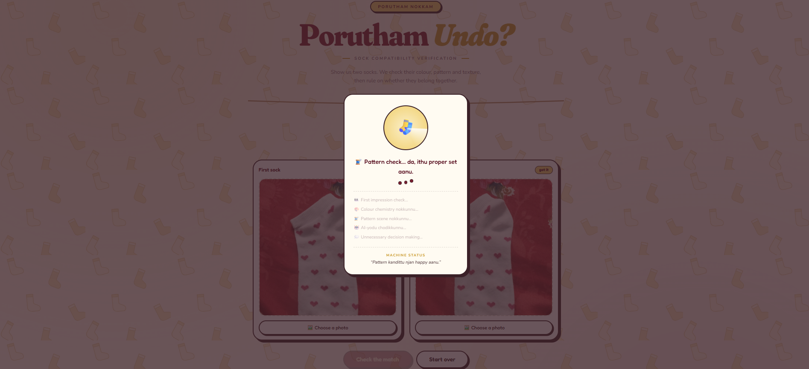
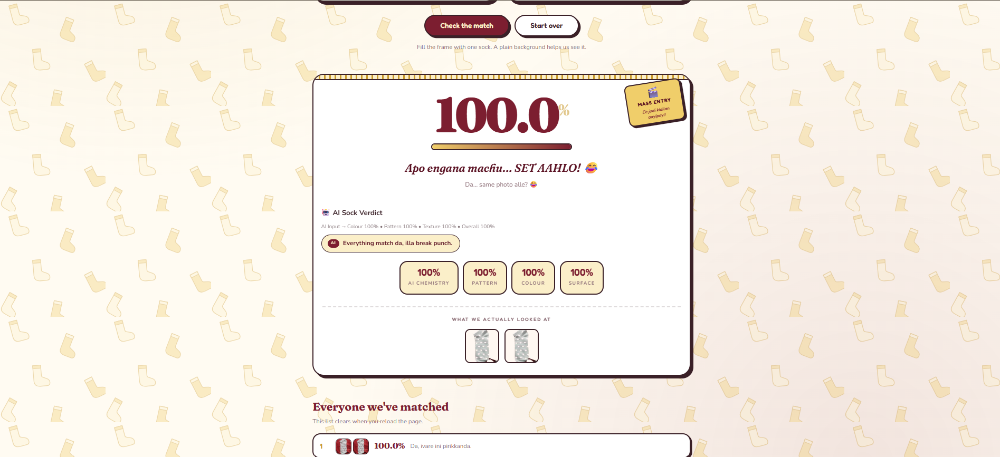

# Porutham Undo? 🎯

## Basic Details

### Team Name: Porutham

### Team Members
- Team Lead: Mirsal Fathima Ajeeb - Saintgits College of Applied Sciences
- Member 2: Renjana S P - Saintgits College of Applied Sciences

### Project Description
Porutham Undo? is an unnecessarily intelligent sock-matching system that uses computer vision and AI to decide whether two socks belong together. It analyzes their visual features, calculates a compatibility percentage, and delivers a completely unnecessary AI verdict.

### The Problem (that doesn't exist)
People have been matching socks using common sense for years. But how can we be sure that two socks are truly meant to be together?

Porutham Undo? solves this extremely serious problem that absolutely nobody asked us to solve.

### The Solution (that nobody asked for)
Porutham Undo? uses computer vision and AI to scientifically determine whether two socks belong together.

The system analyses their colour, pattern, and texture, calculates a compatibility score, and gives an AI-powered verdict — because apparently saying "these two socks match" is no longer enough.

## Technical Details

### Technologies/Components Used

**For Software:**
- Languages used: HTML5, CSS3, Vanilla JavaScript 
- Frameworks used: None
- Libraries used: Canvas API, Browser Language Model API, Web Audio API, Camera/Media APIs
- Tools used: Computer Vision, Image Processing, On-device LLM

**For Hardware:**
- N/A — this is a purely software-based web application. No hardware components were used.

---

## Implementation

**For Software:**

### Installation
No installation needed — it's a static single-file HTML app, and you can try it live right now without cloning anything:

🔗 **Live Site:** https://mirzalfathimaajeeb.github.io/Porutham_Undo/

If you'd rather run it locally, clone it instead:git clone https://github.com/mirzalfathimaajeeb/Porutham_Undo.git

## Project Documentation

### For Software:

#### Project Summary

**Porutham Undo? 🧦❤️** is an intentionally unnecessary AI-powered web application created to solve one of the most serious problems nobody has ever asked us to solve: **finding out whether two socks actually belong together.**

People normally match socks simply by looking at them. Porutham Undo? takes this completely ordinary task and turns it into an unnecessarily intelligent investigation using **computer vision, image processing, similarity analysis, and AI**.

The user can provide two sock images through the **Camera or Gallery**. Once the two socks are selected, the application begins its analysis and examines their visual characteristics, including **colour, pattern, and texture**. These characteristics are compared to determine how visually similar the two socks are.

The system then converts the comparison into a **compatibility percentage**, giving the user a completely scientific-looking answer to the question:

> **"Porutham Undo?" 🧦❤️**

But the project does not stop at a simple percentage. The analysed result is also interpreted using an **on-device language model**, which generates an AI-powered verdict about the relationship between the two socks. This makes the experience more entertaining while demonstrating how AI can be integrated into a browser-based application without requiring a traditional backend.

The application is designed to make the entire experience playful and interactive. Instead of presenting a boring technical result, it uses **humorous messages, scanning effects, animations, visual feedback, and sound effects** to make the sock-matching process feel like a serious AI investigation.

### Key Features

- 🧦 **Two-Sock Comparison** – Analyse two socks and determine their visual compatibility.
- 📷 **Camera Support** – Capture sock images directly using the device camera.
- 🖼️ **Gallery Support** – Upload existing sock images from the device.
- 🎨 **Colour Analysis** – Compare the colour characteristics of the two socks.
- 🌀 **Pattern Analysis** – Examine similarities and differences in their visual patterns.
- 🧶 **Texture Analysis** – Consider texture-related visual characteristics during comparison.
- 📊 **Compatibility Score** – Convert the analysis into an easy-to-understand percentage.
- 🤖 **AI-Powered Verdict** – Use an on-device language model to interpret the result.
- 🔊 **Interactive Sound Effects** – Add audio feedback during different stages of the experience.
- ✨ **Animations & Visual Effects** – Make the scanning and result process more engaging.
- 😂 **Humorous Results** – Turn the final judgement into a fun "relationship" verdict for the socks.
- 🌐 **Browser-Based** – Runs directly in a modern web browser without requiring a separate application.
- 📱 **Device Friendly** – Can be accessed from supported desktop and mobile browsers.
- 🔒 **Client-Side Experience** – The project is designed around browser-based processing and AI capabilities.

### How It Works

```text
Two Sock Images
       ↓
Camera / Gallery Input
       ↓
Image Processing
       ↓
Colour + Pattern + Texture Analysis
       ↓
Similarity Comparison
       ↓
Compatibility Percentage
       ↓
On-Device AI Interpretation
       ↓
AI Sock Verdict
       ↓
"PORUTHAM UNDO?" 🧦❤️

#### Screenshots (Add at least 3)

*Homepage — drop in two sock photos to begin the interrogation*


*Homepage — drop in two sock photos to begin the interrogation*


*The scanning sequence — colour, pattern and texture checks running live*


*The verdict card — score, roast, and cinema-style sticker reveal*

#### Diagrams

*User uploads two sock photos → canvas-based background removal isolates each sock → colour histogram + pattern intersection comparison → weighted compatibility score calculated → Manglish verdict engine picks a matching roast/praise line → optional on-device AI (Gemini Nano) generates an extra one-line commentary → result displayed with score, verdict, sticker and confetti (if applicable)*

### For Hardware:

#### Schematic & Circuit
- N/A — no circuit or schematic, this project has no hardware component.

#### Build Photos
- N/A — no physical components, build process, or hardware build for this project.

---

## Project Demo

### Video
[Add your demo video link here]
*Demonstrates uploading two mismatched socks and two matching socks, showing the scoring difference and the sass level scaling accordingly — from a savage roast on a bad pair to full confetti celebration on a great match.*


## Team Contributions
- Mirsal Fathima Ajeeb: Full frontend build, image analysis algorithm, Manglish dialogue writing, GitHub setup and deployment
- Renjana S P: [Fill in her specific contributions]

---

*Made with 🧦 · No socks were separated in the making of this*

